import { FactBox, MathBlock } from '@blog'
import SineWaveSimulator from './SineWaveSimulator'

<TableOfContents {...props} />

LTE (4G) functions on a wide range of frequencies. These frequency ranges are called bands, and are standardised across the world.

These frequencies range from as low as 410 MHz up to almost 6 GHz in some cases, but not all of these frequency bands are supported on every
device.

## How does frequency link to speed?

It doesn't really, and it's a common misconception of how radio frequency (RF) systems work. Frequency on its own makes no difference to the
speeds you can achieve on LTE.

The frequency is a **carrier frequency**, meaning that its only role is to carry the LTE signal. The signal itself is encoded into a channel with
a set width (such as 10 MHz or 20 MHz).

In fact, the data carried on that signal can be moved to any other frequency as long as the available bandwidth is the same. In the example
animation below, we can copy a 20 MHz bandwidth signal from 2100 MHz to 800 MHz without any loss in data.

The only way that frequency and speed are linked is in their ability to penetrate surfaces.

### Penetrating power

In general, lower frequency (longer wavelength) waves can pass more easily through dense substances. For example, you can hear bass notes from
music through walls more easily than you can hear singing.

<FactBox title="Bear with me...">

This might look pretty complex, but stick with the explanation. It's simpler than it looks, I promise!

</FactBox>

As a wave, such as radio waves, travel through materials, they lose some of their energy. While they travel through the air, energy loss is
minimal, allowing waves to travel for kilometres in ideal circumstances. When they travel through denser materials, such as brick or concrete,
they lose more energy.

There are two main equations that can be used to represent wave energy. One relates frequency to energy, and the other relates wavelength to
energy.

<MathBlock
  title="Wave energy equations"
  math="\text{wave energy} = \text{planck's constant} \times \text{frequency} \\ \text{wave energy} = \frac{\text{planck's constant}\times\text{speed of light}}{\text{wavelength}}"
  footer="True for all electromagnetic waves"
/>

Both $\text{speed of light}$ and $\text{planck's constant}$ are constant (values that don't change). This means that we can infer that **the
higher the frequency, the higher the wave's energy** and that **the lower the wavelength, the higher the wave's energy**. Wavelength and
frequency are directly linked: increasing frequency will decrease the wavelength, and vice versa. You can see this in the demo below.

<SineWaveSimulator />
