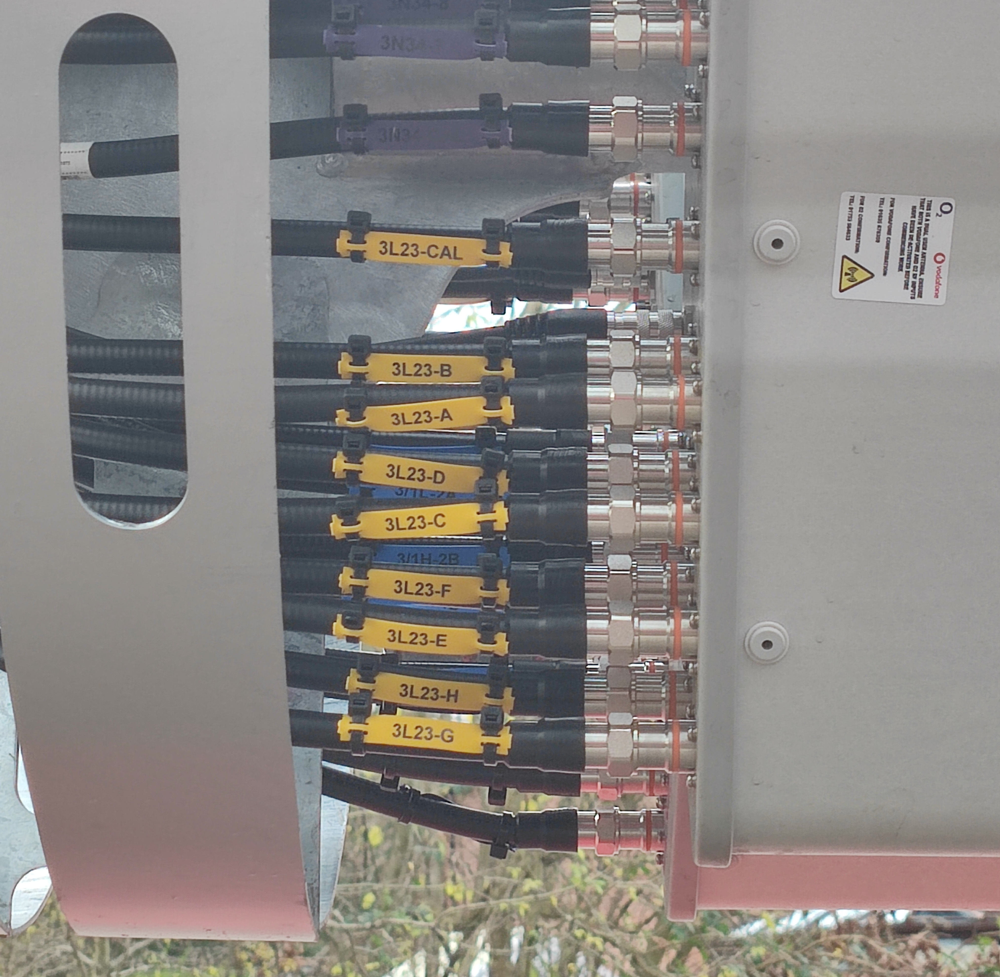
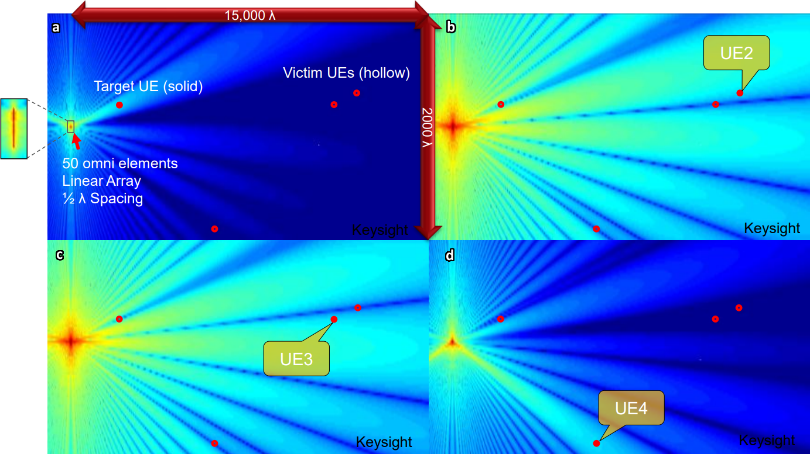

import { FactBox, MathBlock, Tooltip, SpectrumMap } from '@blog'
import Band40 from '@data/SpectrumAllocation/Bands/40'

<TableOfContents {...props} />

# A brief history

O2 (<Tooltip text="MCC: 234, MNC: 10"><code>234/10</code></Tooltip>) is the largest network operator in the United Kingdom in terms of customers.
Including its <Tooltip text="Mobile virtual network operators">MVNOs</Tooltip>, O2's customer base totals a whopping 36.2 million customers in a
country of just 67 million, meaning they have a market share of 54%.
([Source](https://news.o2.co.uk/press-release/o2-continues-customer-growth-and-profitability-as-it-supports-uk-through-pandemic))

In the past, O2 has had a fairly troublesome history in terms of capacity. Many parts of the UK which used to be more rural have expanded over
time, resulting in O2 sites which used to be more than capable of providing decent performance to customers within their zone painful to use.
This is extremely prevalent with their main deployments being 800 MHz LTE across rural and suburban United Kingdom.

# Approaches to capacity management

O2's approaches to capacity management have been successful to varying degrees, but all put together, they result in a positive impact in urban
areas, such as large towns and cities. This section won't cover everything, as that's deserving of its own separate page, and Peter already did a
great job at it.

> This section is heavily influenced by [Peter Clarke](https://twitter.com/pedroclarke1)'s
> [O2 capacity management page](https://pedroc.co.uk/content/o2-capacity-approaches) on his website.

## LTE 2300 MHz (B40) and MIMO

O2 holds a total of 40 MHz of unpaired spectrum in the 2300 MHz TDD band (LTE band 40), with the remaining 60 MHz being used by the Ministry of
Defence.

<SpectrumMap
  caption="UK B40 (2300 MHz) spectrum map"
  note="This does not apply to Northern Ireland, where the MoD own the full 100 MHz spectrum allocation."
  data={Band40}
/>

O2 B40 LTE sites are often deployed on a 4x4 antenna setup, meaning they can transmit and receive four streams of data simultaneously on 4
separate antennae. Some of O2's Nokia vendor sites also operate an 8x8 antenna setup, meaning that they can transmit and receive 8 streams of
data simultaneously (though individual devices are capped at 4 streams).

MIMO is a way of increasing the speed of a data connection by broadcasting multiple signal streams at once. You can learn more about how MIMO
works, and why it's beneficial in [my previous article](/blog/2021/12/22/lte-mimo).

### 8T8R 2300 MHz

In a large number of O2's B40 LTE deployments, we've seen them using 8x8 antenna configurations. In 4x4 deployments, sites could transmit four
streams of data to two UEs at once, which is referred to as SU-MIMO (single user MIMO). However with 8x8 configurations, sites can transmit four
streams of data to two different devices simultaneously, effectively resulting in doubled capacity on that site.

<figure>

<figcaption>

Eight feeders, labelled as 2300 MHz LTE (Band 40) on a brand new O2 Orion monopole deployment.

</figcaption>
</figure>

### Massive MIMO 2300 MHz

In a few select locations, O2 instead equip their sites with **massive MIMO**. This allows for directional beamforming to be used. This is where
users data streams are directed towards a user's device, rather than spewed into the air in all directions.

Initially, you might think that this is purely to allow for higher speeds as a result of reduced signal-to-noise ratio and increased power, due
to the signal being focused at the UE directly, but there is more to it than this.

In fact, one of the major benefits of massive MIMO is that the site can transmit to multiple UEs at the exact same time. This can be done since
the individual streams can be directed such that they do not interfere with one another.

This relies on users being located apart from one another. If two or more users are located near to each other, it is harder for the radio to
form beams towards one of them, while keeping a null zone around the other's position.

import MassiveMimoDiagram from './MassiveMimoDiagram'

<MassiveMimoDiagram>

</MassiveMimoDiagram>

<!--
- Kathrein 78211593 https://marketplace.shields-e.com/Product/Details/78211593
  - RET - tilting the antenna
    - no longer motors -- phase control
    - altering the time antennas receive the signal changes the tilt
  - https://en.wikipedia.org/wiki/Beam_tilt
- feeder tag - CAL -> calibration port
  - for beams, esp high TRx levels
- n78 5G 8TRx
  - missing 5G RRUs
- Commscope antennas, rather than typical Huawei https://www.commscope.com/product-type/antennas/base-station-antennas-equipment/base-station-antennas/itemrrzzt4s4-65b-r6/
  - high port config
-->
