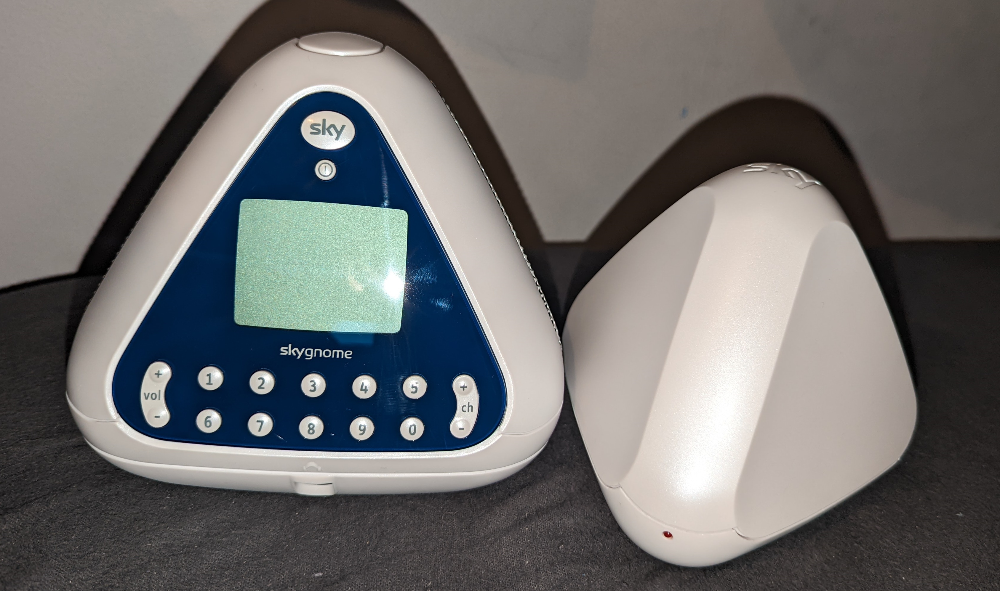

<TableOfContents {...props} />

# Introduction

The Sky Gnome is a battery-operated, rechargable wireless speaker designed for listening to audio from your Sky or Sky+ box around your house. It
released in September 2005 but was discontinued only two years later in mid-2007.

Sky launched it as part of its Sky Digital brand, as a way to listen to radio stations and TV channels from anywhere in your home. At the time of
release, this presented several advantages to potential users, primarily the fact that DAB radio had not been fully deployed across the UK, and
Sky's satellite services often provided much better audio quality than the analogue radio or television counterparts.

I had fond memories of when I was younger, and my dad would listen to the radio in the mornings on his orange Sky Gnome in the bedroom, and I
would mess with the channels on the Sky box downstairs to change it away from the radio station, like the cheeky child I was.

When I sawy a brand-new-in-box Sky Gnome on an online second-hand marketplace in early 2022 for just under £20, which was a bargain for the
condition it was in, I couldn't help but pounce it.

# Make-up of a Sky Gnome

<figure>

<figcaption>

A blue Sky Gnome, and its tranciever base station

</figcaption>
</figure>

The Sky Gnome comes in two main parts: the wireless speaker and controller, as well as the base station.

In terms of inputs, the wireless speaker and controller has a Sky and power button, as well as volume and channel rockers, and 10 numbered
buttons. It's also got an LCD display (which displays the current channel information, and the current volume), as well as a 3.5mm headphone
output and 3.5mm line output, along with a 9V DC input jack.

From the factory, the Sky Gnome ships with a 7.2V 1000mAh nickel cadmium (NiCd) rechargable battery, which recharges in approximately 8 hours
when the Gnome is plugged into power.

The base station is slightly smaller than the speaker portion, and has only 9V DC input, a 6-pin RJ-11 connector (for the Sky box serial
interface), and a set of stereo RCA audio inputs. A small red LED lights up on the front of the base station when it is connected to power.

## Using a Sky Gnome

Short searching on the internet will make you believe that the Sky Gnome must be used with a Sky Digibox or Sky+ Box, along with the RS232 serial
port on these boxes. This is definitely true if you wish to make use of all of its features, but if you only care about the audio aspect.
